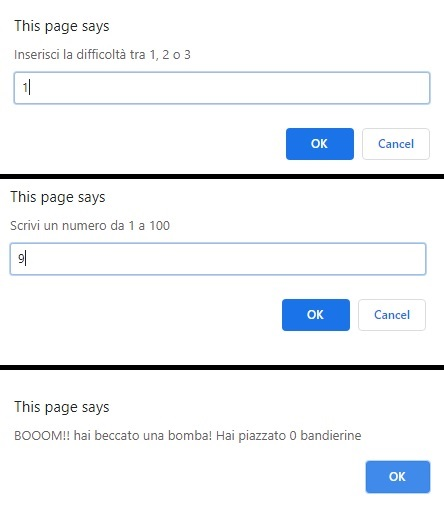

# Js-campominato
The computer generates 16 random numbers from 1 to 100.   
The user enters one number at a time between 1 to 100.   
If the number is present in the list of generated numbers, the game ends,   
otherwise the game continues by asking the user for another number.   
The game ends when the player enters a "forbidden" number or reaches   
the maximum possible numbers of numbers allowed.   
At the end of the match the software communicates the score, i.e. the number
of times that the user has entered an allowed number.

The user can also select the difficulty that determines the maximum number:

Difficulty 1 = 100   
Difficulty 2 = 80    
Difficulty 3 = 50   

I have created 2 versions of the game, one with JavaScript (playable in the browser) and the other with Python.
***
### [Live Version](https://gianluigivitale.github.io/js-campominato/)
***
### Preview:

